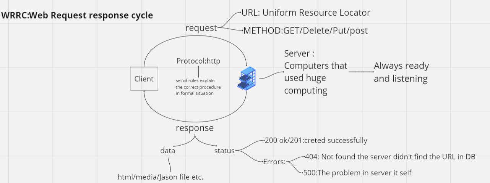

# Movies-Library -1.0

**Author Name**: Assad Almughrabi

## WRRC

## Overview

It's a movies website that help you to watch what you need free withou Ads

## Getting Started
<!-- What are the steps that a user must take in order to build this app on their own machine and get it running? -->
### First we need to build the server following these steps: 
* npm init -y -y : yes
* create index.js file , name is optional
* npm install express to install express package to use it
* run the server using node index.js
*  require express framework 
* invoke express
* specify port number
* run server make it liseting

## Project Features
<!-- What are the features included in you app -->